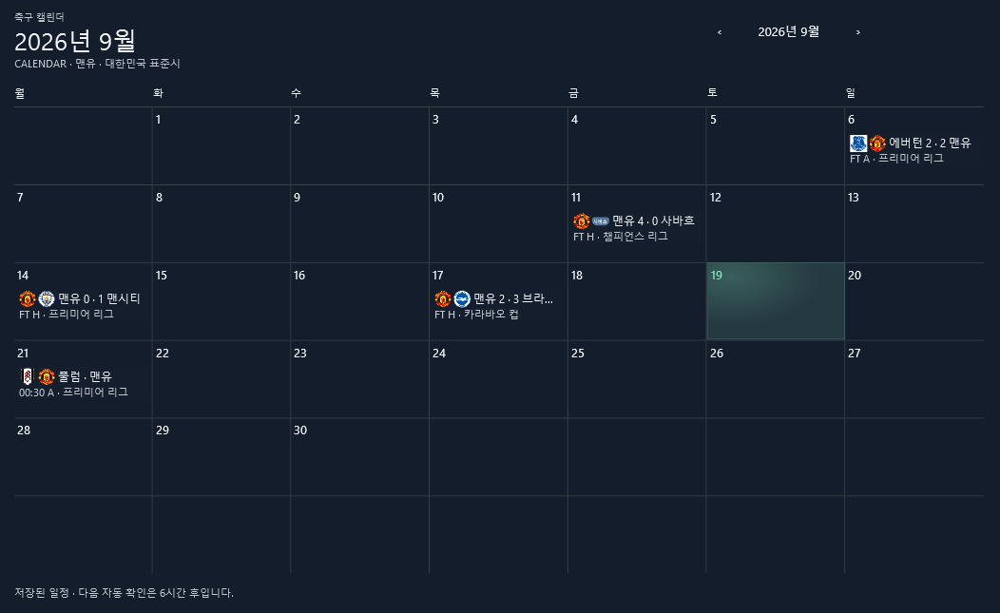
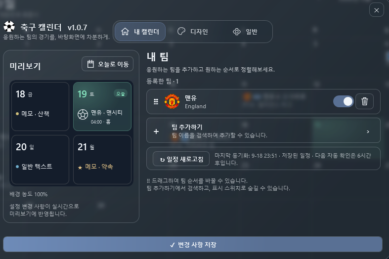
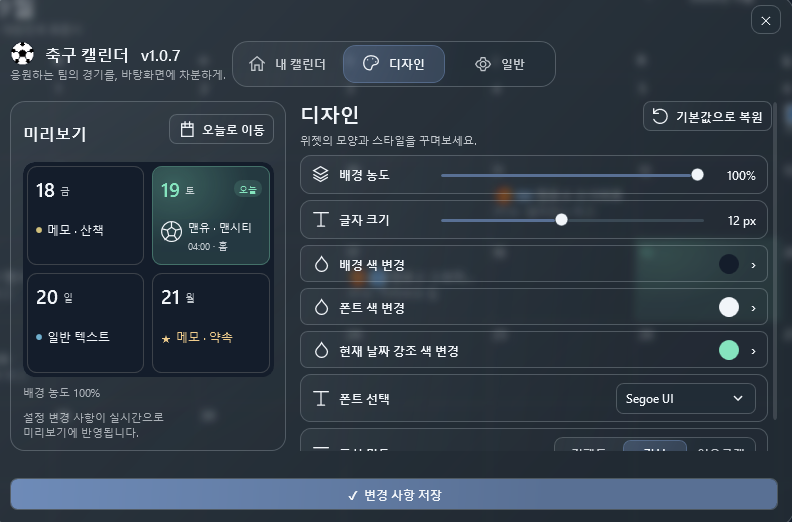
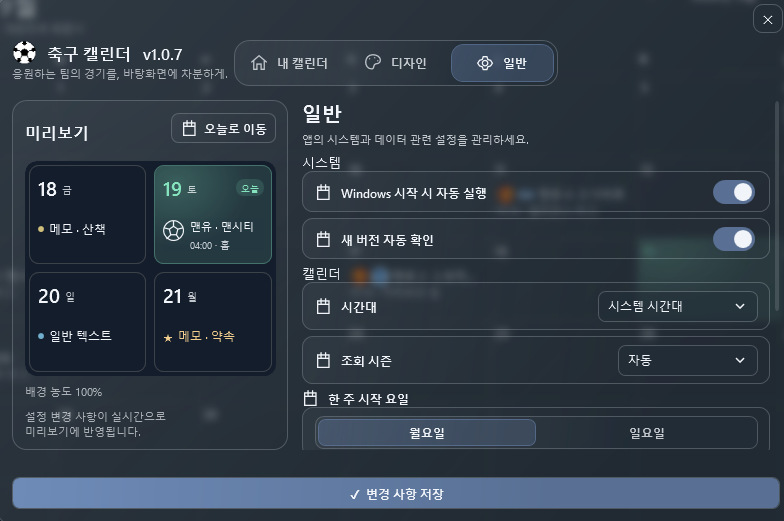
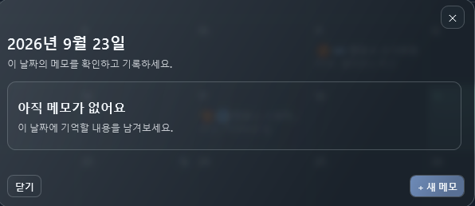
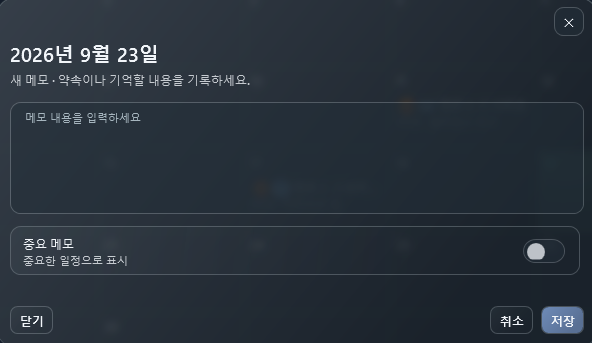
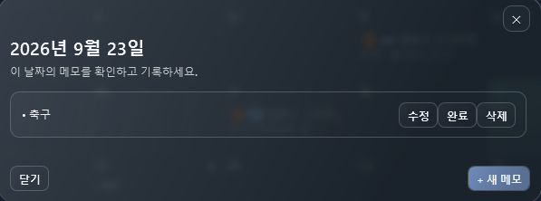

# ⚽ 축구 캘린더
축구 캘린더 프로그램 입니다

좋아하는 축구팀의 경기 일정을
윈도우 바탕화면에서 바로 확인할 수 있는 캘린더입니다.

## 주요 기능

- 원하는 축구팀 선택
- 경기 일정 자동 표시
- 종료된 경기 스코어 확인
- 날짜별 메모
- 배경 투명도 / 글자 크기 / 색상 설정
- 시간대 및 조회 시즌 설정
- Windows 시작 시 자동 실행
- 새 버전 자동 업데이트 확인
## 메인 캘린더 화면

- ## 📸 화면

- ### 팀 선택 / 설정 탭

### 디자인 변경 / 설정 탭

### 일반 설정 / 설정 탭

### 메모

최신 버전은 오른쪽의 **Releases**에서 다운로드할 수 있습니다.

압축을 푼 뒤 `축구 캘린더.exe`를 실행하면 됩니다.

## ⚠️ 처음 실행할 때

Windows에서 보호 메시지가 표시될 수 있습니다.

`추가 정보 → 실행`

을 누르면 실행할 수 있습니다.

## 🔄 업데이트

새 버전이 있으면 프로그램 실행 시 업데이트를 확인합니다.
기존 팀 설정, 메모 등의 사용자 데이터는 유지됩니다.
